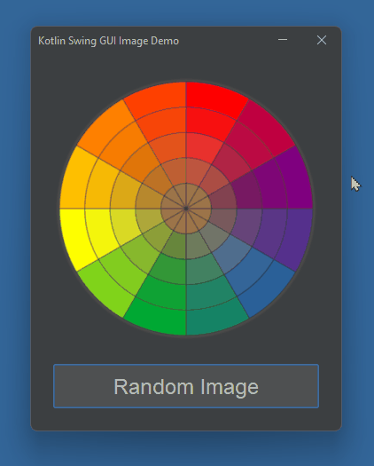

# Kotlin GUI Images Demo

This is a demo showing how images can be displayed in a Kotlin / Swing GUI

Images are pulled from an **images folder** within the [src](src/) folder. Images can be **JPEG**, **PNG** or **GIF** format.

